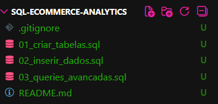
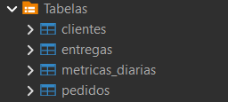
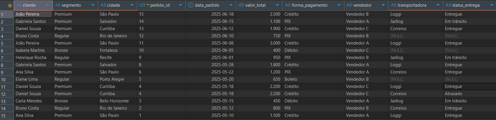
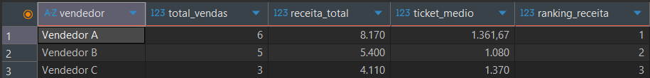
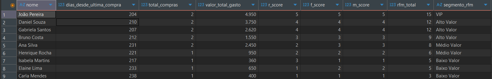
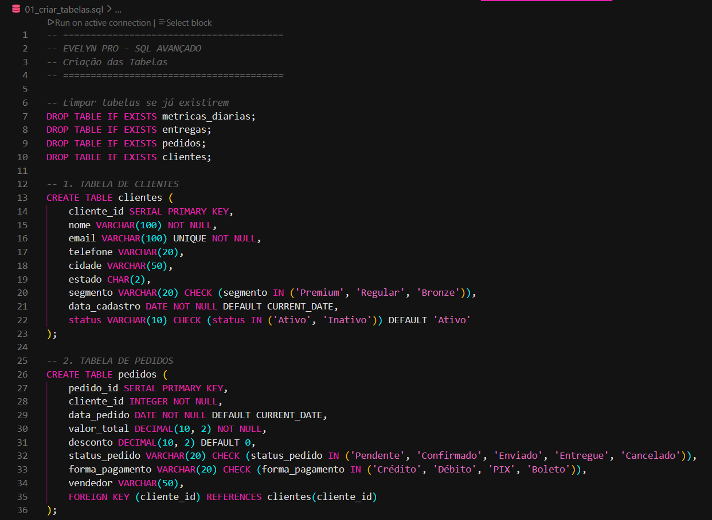

# 🗄️ Evelyn PRO - SQL Avançado para Análise de Dados


## 📊 Sobre o Projeto

Projeto de portfólio técnico demonstrando **domínio de SQL avançado** para análise de dados corporativos em ambiente PostgreSQL. Desenvolvi um banco de dados relacional completo com **4 tabelas** e **10 queries complexas** que simulam cenários reais de análise de negócios.

### 🎯 Objetivo

Demonstrar habilidades técnicas em:
- Modelagem de dados relacionais
- Queries SQL otimizadas para Business Intelligence
- Análise avançada com CTEs e Window Functions
- Segmentação de clientes e análise RFM
- Preparação de dados para dashboards

---

## 🛠️ Tecnologias Utilizadas

| Tecnologia | Versão | Uso |
|-----------|--------|-----|
| **PostgreSQL** | 15+ | Banco de dados relacional |
| **DBeaver** | 23+ | IDE para desenvolvimento SQL |
| **VSCode** | Latest | Editor de código |
| **Git** | 2.0+ | Controle de versão |

---

## 📋 Estrutura do Banco de Dados

O banco `evelyn_pro_analytics` contém 4 tabelas relacionais com **47 registros** no total:

### 🔹 **Tabela: clientes** (10 registros)
```sql
cliente_id (PK) | nome | email | telefone | cidade | estado | segmento | data_cadastro | status
```
**Relacionamentos:** 1:N com `pedidos`

### 🔹 **Tabela: pedidos** (15 registros)
```sql
pedido_id (PK) | cliente_id (FK) | data_pedido | valor_total | desconto | 
status_pedido | forma_pagamento | vendedor
```
**Relacionamentos:** N:1 com `clientes` | 1:N com `entregas`

### 🔹 **Tabela: entregas** (12 registros)
```sql
entrega_id (PK) | pedido_id (FK) | data_envio | data_entrega_prevista | 
data_entrega_real | status_entrega | transportadora | custo_frete
```
**Relacionamentos:** N:1 com `pedidos`

### 🔹 **Tabela: metricas_diarias** (10 registros)
```sql
metrica_id (PK) | data_referencia | visitas_site | conversoes | 
ticket_medio | taxa_conversao
```

### 📊 Diagrama de Relacionamentos

```
┌─────────────┐         ┌─────────────┐         ┌─────────────┐
│  clientes   │ 1     N │   pedidos   │ 1     N │  entregas   │
│─────────────│◄────────│─────────────│◄────────│─────────────│
│ cliente_id  │         │ pedido_id   │         │ entrega_id  │
│ nome        │         │ cliente_id  │         │ pedido_id   │
│ segmento    │         │ valor_total │         │ transporta. │
└─────────────┘         └─────────────┘         └─────────────┘

                        ┌──────────────────┐
                        │ metricas_diarias │
                        │──────────────────│
                        │ data_referencia  │
                        │ conversoes       │
                        └──────────────────┘
```

---

## 🎯 10 Queries de Análise Avançada

### ✅ Técnicas Aplicadas

| Técnica | Queries |
|---------|---------|
| **JOINs Múltiplos** (INNER, LEFT, RIGHT) | #1, #3, #5, #7 |
| **CTEs** (Common Table Expressions) | #2, #3, #4, #9, #10 |
| **Window Functions** (RANK, LAG, NTILE) | #2, #4, #5, #6, #10 |
| **Agregações Complexas** | #2, #3, #7, #8, #9 |
| **Análise RFM** | #10 |
| **Moving Averages** | #6 |

### 📌 Casos de Uso

#### 1️⃣ **Análise 360º de Pedidos**
**Técnica:** INNER JOIN + LEFT JOIN  
**Objetivo:** Visão completa de clientes, pedidos e entregas em uma única consulta

```sql
SELECT 
    c.nome AS cliente,
    c.segmento,
    p.valor_total,
    e.transportadora,
    e.status_entrega
FROM clientes c
INNER JOIN pedidos p ON c.cliente_id = p.cliente_id
LEFT JOIN entregas e ON p.pedido_id = e.pedido_id
WHERE p.status_pedido != 'Cancelado'
ORDER BY p.data_pedido DESC;
```

**Resultado:** 14 linhas com informações integradas de 3 tabelas

---

#### 2️⃣ **Performance de Vendedores**
**Técnica:** CTE + Window Function (RANK)  
**Objetivo:** Ranking de vendedores por receita e volume de vendas

```sql
WITH vendas_vendedor AS (
    SELECT 
        vendedor,
        COUNT(*) AS total_vendas,
        SUM(valor_total - desconto) AS receita_total,
        AVG(valor_total - desconto) AS ticket_medio
    FROM pedidos
    WHERE status_pedido != 'Cancelado'
    GROUP BY vendedor
)
SELECT 
    vendedor,
    total_vendas,
    ROUND(receita_total, 2) AS receita_total,
    RANK() OVER (ORDER BY receita_total DESC) AS ranking_receita
FROM vendas_vendedor;
```

**KPIs gerados:** Total de vendas | Receita | Ticket médio | Ranking

---

#### 3️⃣ **Lifetime Value de Clientes**
**Técnica:** CTE + Agregações + Date Functions  
**Objetivo:** Identificar clientes de alto valor e padrões de recompra

**Métricas calculadas:**
- 💰 LTV (Lifetime Value)
- 🎯 Ticket médio por cliente
- 📅 Tempo de relacionamento (dias)
- 🔄 Frequência de compra

---

#### 4️⃣ **Crescimento Mês a Mês**
**Técnica:** Window Function (LAG) + DATE_TRUNC  
**Objetivo:** Análise temporal com cálculo de variação percentual entre meses

**Output:** Crescimento/queda de receita mês anterior → mês atual

---

#### 5️⃣ **Ranking de Clientes por Receita**
**Técnica:** Window Function (RANK + PARTITION BY)  
**Objetivo:** Classificação geral e por segmento de mercado

**Diferenciais:**
- Ranking geral (todos os clientes)
- Ranking segmentado (Premium, Regular, Bronze)

---

#### 6️⃣ **Tendências de Conversão**
**Técnica:** Moving Average (Média Móvel de 3 dias)  
**Objetivo:** Suavizar flutuações e identificar tendências reais

```sql
SELECT 
    data_referencia,
    taxa_conversao,
    ROUND(AVG(taxa_conversao) OVER (
        ORDER BY data_referencia 
        ROWS BETWEEN 2 PRECEDING AND CURRENT ROW
    ), 2) AS media_movel_3dias
FROM metricas_diarias;
```

---

#### 7️⃣ **Análise Multidimensional**
**Técnica:** GROUP BY múltiplo + Agregações  
**Objetivo:** Cruzamento segmento × forma de pagamento

**Insights:** Identificar preferências de pagamento por perfil de cliente

---

#### 8️⃣ **Performance Logística**
**Técnica:** CASE WHEN + Agregações condicionais  
**Objetivo:** Avaliar eficiência de transportadoras

**Métricas:**
- Taxa de sucesso nas entregas
- Custo médio de frete
- Prazo médio de entrega (em dias)

---

#### 9️⃣ **Dataset para Dashboard (KPIs)**
**Técnica:** CTE + Agregações + DISTINCT  
**Objetivo:** Resumo executivo pronto para Power BI / Looker Studio

**KPIs gerados:**
- Total de clientes
- Clientes ativos (últimos 30 dias)
- Receita total
- Ticket médio
- Total de vendedores

---

#### 🔟 **Segmentação RFM**
**Técnica:** CTE encadeada + NTILE + CASE WHEN  
**Objetivo:** Classificar clientes em segmentos de marketing

**Variáveis RFM:**
- 🕒 **Recency:** Dias desde última compra
- 🔢 **Frequency:** Total de compras
- 💵 **Monetary:** Valor total gasto

**Segmentos criados:**
- 🌟 VIP (pontuação 13-15)
- ⭐ Alto Valor (9-12)
- 📊 Médio Valor (6-8)
- 📉 Baixo Valor (3-5)

```sql
-- Exemplo de classificação RFM
CASE 
    WHEN (r_score + f_score + m_score) >= 13 THEN 'VIP'
    WHEN (r_score + f_score + m_score) >= 9 THEN 'Alto Valor'
    WHEN (r_score + f_score + m_score) >= 6 THEN 'Médio Valor'
    ELSE 'Baixo Valor'
END AS segmento_rfm
```

---

## 🚀 Como Executar

### 📦 Pré-requisitos

- PostgreSQL 15+ instalado
- DBeaver ou pgAdmin
- Git (opcional)

### ⚙️ Instalação

**1. Clone o repositório**
```bash
git clone https://github.com/evemoura56-cloud/evelyn-pro-sql.git
cd evelyn-pro-sql
```

**2. Crie o banco de dados**
```bash
createdb evelyn_pro_analytics
```

**3. Execute os scripts na ordem**

No DBeaver ou via terminal:

```bash
# Script 1: Criar estrutura das tabelas
psql -d evelyn_pro_analytics -f 01_criar_tabelas.sql

# Script 2: Inserir dados de exemplo
psql -d evelyn_pro_analytics -f 02_inserir_dados.sql

# Script 3: Executar queries de análise
psql -d evelyn_pro_analytics -f 03_queries_avancadas.sql
```

### ✅ Validar instalação

Execute no DBeaver:

```sql
-- Verificar total de registros
SELECT 'clientes' AS tabela, COUNT(*) FROM clientes
UNION ALL
SELECT 'pedidos', COUNT(*) FROM pedidos
UNION ALL
SELECT 'entregas', COUNT(*) FROM entregas
UNION ALL
SELECT 'metricas_diarias', COUNT(*) FROM metricas_diarias;
```

**Resultado esperado:**
| tabela | count |
|--------|-------|
| clientes | 10 |
| pedidos | 15 |
| entregas | 12 |
| metricas_diarias | 10 |

---

## 📸 Capturas de Tela

### 🗂️ Estrutura do Projeto no VSCode
<!-- Adicione aqui: print da estrutura de pastas no VSCode -->


### 🗄️ Tabelas Criadas no DBeaver
<!-- Adicione aqui: print do painel lateral do DBeaver mostrando as 4 tabelas -->


### 📊 Query 1: Análise 360º de Pedidos
<!-- Adicione aqui: print do resultado da query 1 -->


### 🏆 Query 2: Ranking de Vendedores
<!-- Adicione aqui: print do resultado da query 2 -->


### 🎯 Query 10: Segmentação RFM
<!-- Adicione aqui: print do resultado da query 10 -->


### 💻 Código SQL no VSCode
<!-- Adicione aqui: print de um dos arquivos SQL aberto no VSCode -->


---

## 💡 Diferenciais Técnicos

### 🎓 Conceitos Avançados Aplicados

1. **CTEs (Common Table Expressions)**
   - Queries modulares e reutilizáveis
   - Melhor legibilidade e manutenibilidade
   - Performance otimizada

2. **Window Functions**
   - Cálculos contextuais sem GROUP BY
   - Ranking dinâmico
   - Médias móveis para análise de tendências

3. **Análise RFM**
   - Técnica avançada de segmentação de clientes
   - Usada por empresas de e-commerce e marketing
   - Identificação de clientes de alto valor

4. **Queries Otimizadas**
   - Índices criados em foreign keys
   - Agregações eficientes
   - Preparadas para grandes volumes

---

## 🎯 Casos de Uso Reais

Este projeto pode ser aplicado em:

✅ **E-commerce:** Análise de comportamento de compra  
✅ **Logística:** Monitoramento de entregas e transportadoras  
✅ **Vendas:** Performance de equipe comercial  
✅ **Marketing:** Segmentação de clientes para campanhas  
✅ **BI:** Base para dashboards executivos  

---

## 📈 Próximos Passos

- [ ] Integração com Power BI / Looker Studio
- [ ] API FastAPI para consulta de dados
- [ ] Dashboard interativo com visualizações
- [ ] Testes de performance com dataset maior (10k+ registros)
- [ ] Stored Procedures para automação
- [ ] Views materializadas para queries frequentes

---

## 📚 Aprendizados

Durante o desenvolvimento deste projeto, consolidei conhecimentos em:

- ✅ Modelagem de dados relacionais com cardinalidade 1:N
- ✅ Normalização de banco de dados (3NF)
- ✅ Otimização de queries com índices
- ✅ Análise de dados multidimensional
- ✅ Segmentação de clientes com RFM
- ✅ Window Functions para ranking e médias móveis
- ✅ CTEs para queries complexas e legíveis

---

## 👩‍💻 Sobre a Autora

**Evelyn Moura**  
*Analista de Automação & Processos | Especialista em Dados*

Profissional de tecnologia, com foco em análise de dados, automação de processos e desenvolvimento de soluções inteligentes. Este projeto faz parte do meu portfólio técnico demonstrando habilidades em SQL e Business Intelligence.

### 🔗 Conecte-se comigo

[](https://www.linkedin.com/in/evelyn-moura-dos-santos-6a6094211)
[](https://github.com/evemoura56-cloud)
[](evemoura56@gmail.com)

---

## 📄 Licença

Este projeto está sob a licença MIT. Veja o arquivo [LICENSE](LICENSE) para mais detalhes.

---

## ⭐ Gostou do Projeto?

Se este projeto foi útil para você:
- ⭐ Deixe uma estrela no repositório
- 🔄 Compartilhe com outros desenvolvedores
- 💬 Abra uma issue com sugestões

---

<div align="center">

**Desenvolvido com 💜 por Evelyn Moura**

*"Transformando dados em insights, código em soluções"*

</div>
```

***
